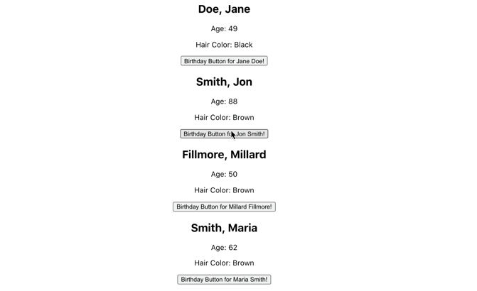

# Putting It Together

## It's week two, baby!

Using the Prop It Up assignment, I created a birthday button that increases users ages by 1 when clicked.
This one was tough but only becasue i forgot to replace the age variable with stateAge.
Learned about hooks in general and specifically useState.
React is complicated but pretty cool! :0

There were 3 objectives for this assignment

- Create a state variable to hold age of person (passed through props)
- Create botton that increases a persons age by 1 when clicked
- Display current value of age from state

